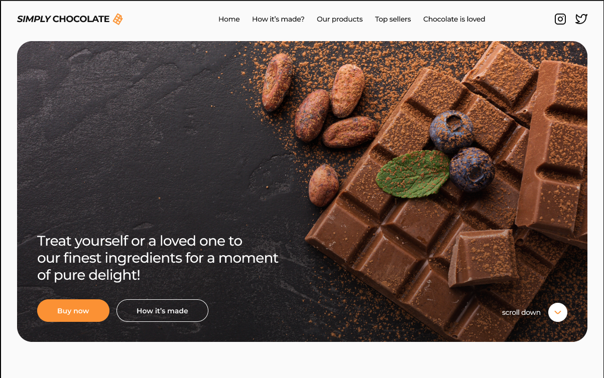

---

<!-- TABLE OF CONTENTS -->

  
Table of Contents

  <ol>
    <li>
      <a href="#about-the-project">About The Project</a>
      <ul>
        <li><a href="#built-with">Built With</a></li>
      </ul>
    </li>
    <li><a href="#contributing">Participants</a></li>
    <li><a href="#acknowledgments">Acknowledgments</a></li>
  </ol>

---

<!-- ABOUT THE PROJECT -->

## About The Project

 
We would like to present to you some Online Store Project

Here's why:

- Implemented different technologies during development.
- Any member can view available products and but it without registration.
- Available adaptive web design, such as mobile, tablet and desktop.

(<a href="#readme-top">back to top</a>)

---

### Built With

(<a href="#readme-top">back to top</a>)

---

<!-- PARTICIPANTS -->

## Participants

- Nina Mateychuk
- Stanislav Bobrivskyi
- Yuriy Beregovoy
- Костя Зінченко
- Тетяна Дубчак

---

<!-- ACKNOWLEDGMENTS -->

## Acknowledgments

- [Vite](https://vitejs.dev/guide/)
- [Code Validator](https://validator.w3.org/nu/#textarea)
- [Caninclude](https://caninclude.glitch.me/)
- [IconMoon](https://icomoon.io/app/#/select)
- [CanIuse](https://caniuse.com/)
- [GitHub Pages](https://pages.github.com)
- [Google fonts](https://fontawesome.com)
- [Squoosh](https://squoosh.app/)
- [SVGOMG](https://jakearchibald.github.io/svgomg/)

(<a href="#readme-top">back to top</a>)

